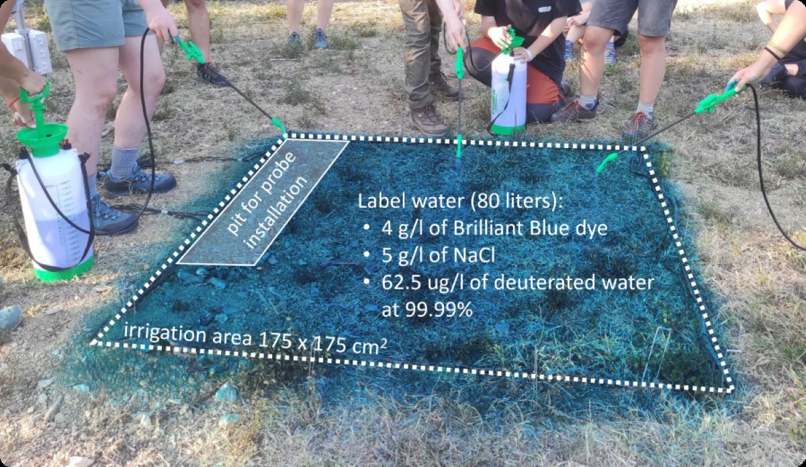
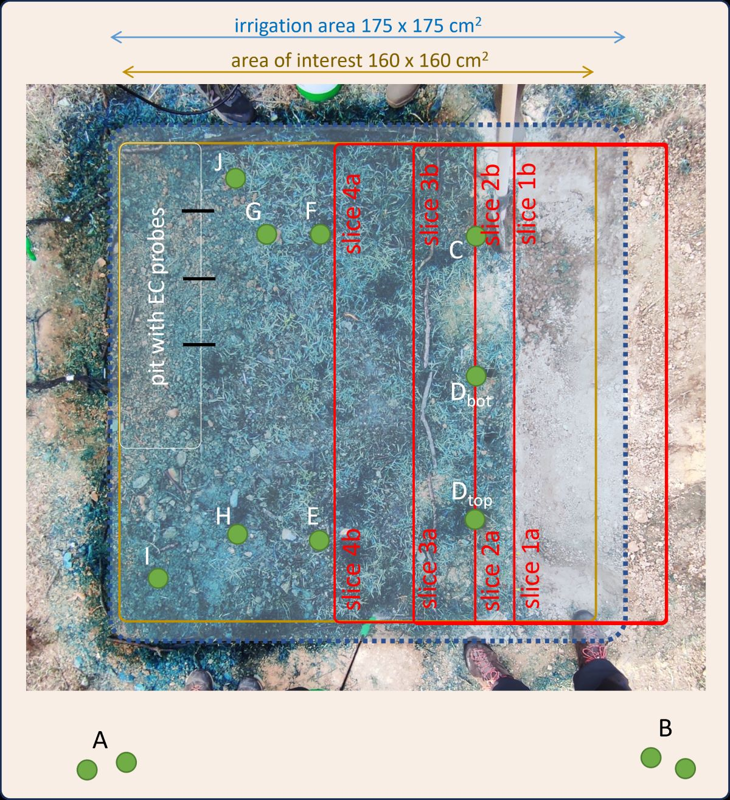
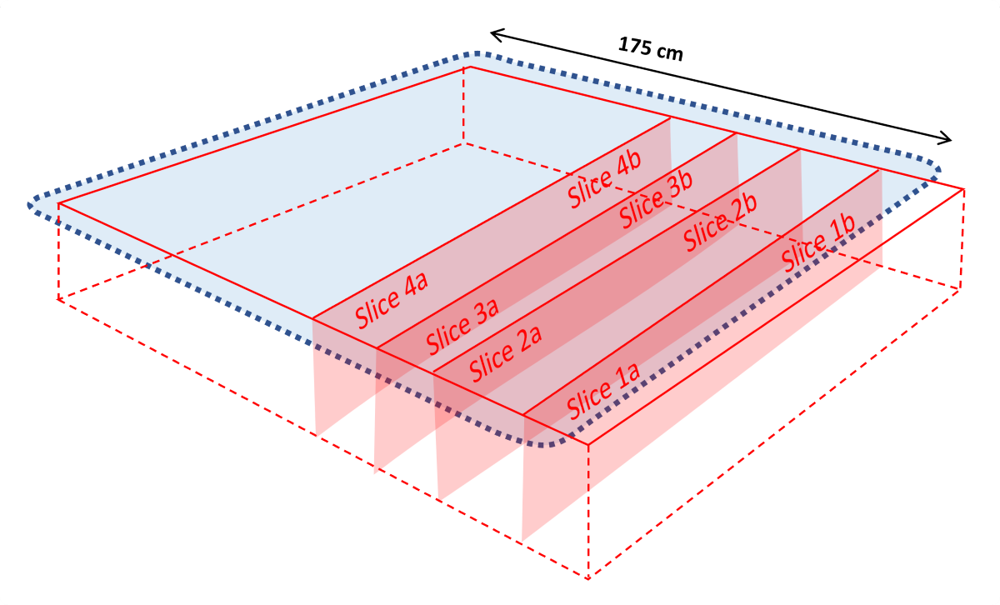
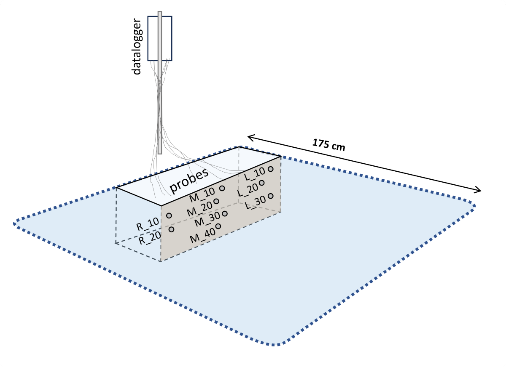
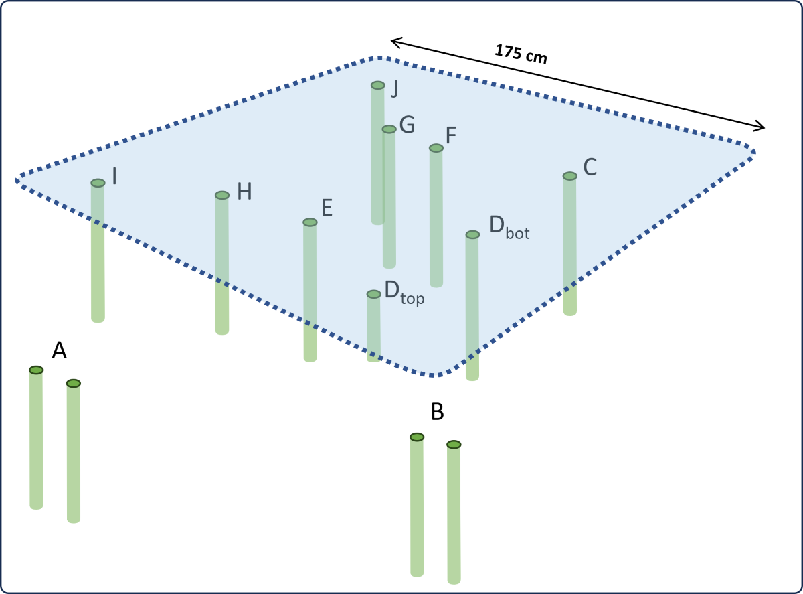
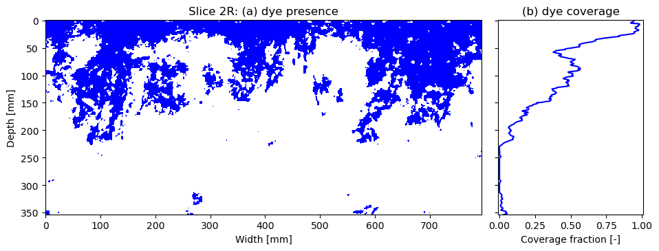
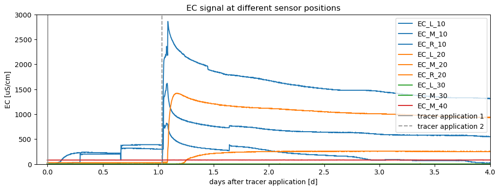
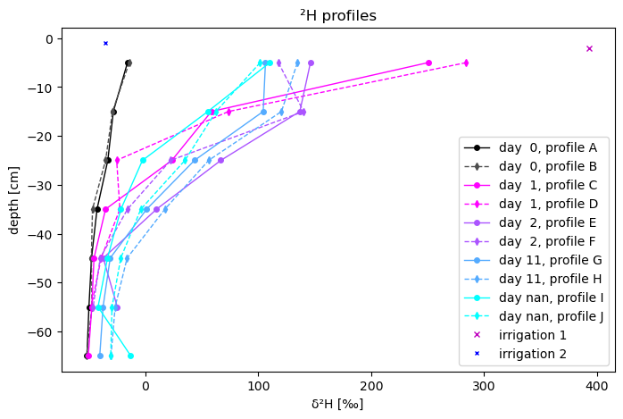

# WATSON Soil Tracer Experiment Data

This repository includes tracer data from a multi-tracer experiment carried out on a single soil plot of 3 m2. The data include:

- Images of brilliant blue dye from 4 soil transects ([DyeImageData](DyeImageData) folder)
- Timeseries of electrical conductivity, temperature and volumetric water content measured through 9 soil moisture probes ([ECSensorData](ECSensorData) folder)
- Isotope composition of 10 soil cores ([IsotopeSampleData](IsotopeSampleData) folder)

These tracer data were collected during a training school on isotopic tracer and labelling experiments, organized as part of the COST Action WATSON. The training school took place near Florence, Italy, between 12-14 September 2023.

Please cite as: Benettin, P., van Meerveld, I., Sprenger, M., & Penna, D. (2024). WATSON Soil Tracer Experiment Data (v1.0) [Data set]. Zenodo. https://doi.org/10.5281/zenodo.10931310

## Experiment Design and Chronology

The main idea behind the experiment was to apply labeled water on top of a soil plot and track it over space and time.

We considered a plot of 3 m2 (square of 1.75 m x 1.75 m) at the Training School venue ([see on Google Map](https://maps.app.goo.gl/LWNWN5TZWTygcvvv9)). The plot was basically flat, with just a very mild south-facing slope.
 
We used 3 tracers to label the water:
- **Brilliant Blue dye**, to visually see the spatial distribution of the tracer
- **NaCl**, to measure the resulting pulse in Electrical Conductivity (EC) through EC sensors that measure at high temporal resolution
- **Deuterium**, to see the tracer in soil profiles analysed for their water isotope composition

## Irrigation 1 

On Sep 12 2023, between 16:40 and 19:00 UTC+01 we applied the three tracers together in a single irrigation of 80 liters (i.e. 27 mm) of tap water using manual sprayers.

The applied water was labeled with:
- 4 g/l of Brilliant Blue dye
- 5 g/l of NaCl (which should make an EC of about 7000 uS/cm)
- 62.5 ug/l of D2O water at 99.99% (which should make the d2H of the solution about +330 permil)

## Irrigation 2

On Sep 13 2023 between 17:30 and 19:45 UTC+01 we applied another 28 mm of tap water <u> that only had NaCl (5 g/l) and not the other tracers</u>. The goal was to better see a breakthrough in the EC signal while pushing down the other tracers.

## Measurement strategy

The image below shows the tracer application area from the top and identifies the different measurement locations. The individual measurements are described below.

### Brilliant Blue Dye data

We excavated 4 transects and took 2 pictures (Left and Right) from each of them. 

The data and additional details are in the [DyeImageData](DyeImageData) folder.

### NaCl data

We measured the pulse in EC at 9 locations:
- Left (L) side, at depths 10 cm, 20 cm and 30 cm  
- Middle (M) side at depths 10 cm, 20 cm, 30 cm, 40 cm 
- Right (R) side at depths 10 cm and 20 cm

Each probe also measured volumetric water content and temperature. The data and additional details are in the [ECSensorData](ECSensorData) folder.

### Isotope data

We collected soil samples on 5 different days, from 2 profiles each day (total 10 profiles): 

- Profiles A-B were collected before the tracer was applied, to evaluate the background condition
- Profiles C-D were collected the day after the tracer application 
- profiles E-F were collected after another day (after the second, unlabeled irrigation)
- profiles G-H were collected after 11 days
- profiles I-J were collected after 19 days 

The bulk soil samples were analysed using the Direct Vapor Equilibration method at the University of Braunschweig, by the group ot Matthias Beyer. 

The data and additional details are in the [IsotopeSampleData](IsotopeSampleData) folder.
	

## Results

A description of the results is available as a jupyter notebook and as html document within each data folder. An example of some results is given below.

### Example of dye image

Dye detection for one slice along with the distribution of dye coverage at each depth.

### Example of conductivity (NaCl) breakthrough

Breakthrough curves in electrical conductivity measured at the different sensor locations after the 2 tracer applications.

### Example of deuterium in soil profiles

Deuterium composition ($\delta ^{2}\textrm{H}$) of soil water collected from the different soil cores and the irrigation water

## License

This work is licensed under a
[Creative Commons Attribution 4.0 International License][cc-by].

[cc-by]: http://creativecommons.org/licenses/by/4.0/